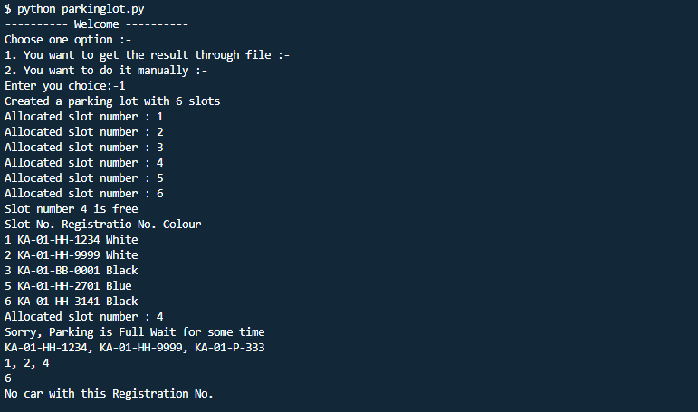

# Parking Lot System

A mini python project in which I tried to create praking lot system with features like park car, leave, get car no by color etc

## Table of contents

- [Parking Lot System](#parking-lot-system)
  - [Table of contents](#table-of-contents)
  - [Technologies](#technologies)
  - [Setup](#setup)
  - [Usage](#usage)
  - [Output](#output)

## Technologies

Project is created with:

- Python: 3.8.5
- Flake8(for liniting)


## Setup

To run this project:

1. Clone this repo.
2. Install Python
3. Install flake8 library:

   - `pip install flake8`

   - goto root directory where `parkinglot.py` file is present.
   - Run `python -m flake8` command and check for any errors:
   - like I got extra length error to ignore that use #noqa at the end

4. run `parkinglot.py`
   - `$ python parkinglot.py`
   - you have to choose 1 option either by file or by command line
5.  In order to use file option you should have file with name `command.txt` in your root directory

## Usage
Note:- please make sure you follow the commands properly
first enter admin and password 
by default it is admin
- Format to be followed

  ```
  1.To create parking lot use 'create_parking_lot <no.>'"
  example:- create_parking_lot 6
  
  2.To park car in parking lot use 'park <car_no.> <car_color>'
  example: park KA-01-HH-1234 white

  3.To leave car in parking lot use 'leave <slot_no>'
  example: leave 4

  4. To get status of parking lot use 'status'
  example: status

  5. To get registration for car with color of parking lot use ' registration_numbers_for_cars_with_colour <color_name> '
  example: registration_numbers_for_cars_with_colour White
  
  6. To get slot for car with color of parking lot use ' slot_numbers_for_cars_with_colour <color_name> '
  example: slot_numbers_for_cars_with_colour White 

  7. To get slot for car with registration of parking lot use ' slot_number_for_registration_number <car_no.>'
  example: slot_number_for_registration_number KA-01-HH-3141  
  
  ```


##  Output
<p align="center">
  
</p>
